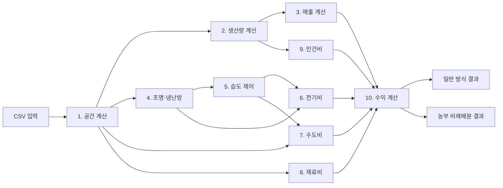

# Profit Calculator 0.2.1

실내농장 사업장의 공간·생산·매출·환경제어 에너지·운영비·수익을 월 단위로 계산하는 Python 콘솔 프로그램입니다.

원본 계산 다이어그램을 10개의 독립 계산 블록으로 나누었으며, `main.py`가 CSV 입력을 읽고 각 블록을 순서대로 실행합니다. 결과는 기존 콘솔 형식 또는 `app.py`의 Streamlit 대시보드로 확인할 수 있습니다. 현재 버전은 상추·딸기·바질과 3개 샘플 사업장을 포함합니다.

## 주요 기능

- 공실 면적과 다단 재배 모듈을 반영한 재배면적 계산
- 작물별 생산량, 상품화율, 판매가격을 반영한 월 매출 계산
- 12개월 외기온도·상대습도에 따른 조명·난방·냉방 전력량 계산
- 증발산, 환기, 냉방 제습을 반영한 가습·제습 전력량 계산
- 조명·냉난방·가습·제습을 모두 포함한 월평균 전력비 계산
- 수도비, 재료비, 최저시급 기준 인건비 계산
- 최저시급 지급 방식과 농부 비례배분 방식의 수익을 모두 출력
- 여러 사업장의 월 영업이익 합산
- 현대적인 Streamlit 카드·탭·표·그래프 대시보드
- 사업장 필터와 요약 결과 CSV 다운로드

콘솔 실행은 Python 표준 라이브러리만 사용합니다. 웹 대시보드 실행에는 `streamlit`과 설치 시 함께 제공되는 `pandas`가 필요합니다.

## 전체 계산 흐름



## 프로젝트 구조

```text
Profit_Calculator 0.2.1/
├─ main.py
├─ console_output.py
├─ app.py
├─ space_calculation.py
├─ production_calculation.py
├─ sales_calculation.py
├─ lighting_hvac_calculation.py
├─ humidity_calculation.py
├─ electricity_cost_calculation.py
├─ water_cost_calculation.py
├─ material_cost_calculation.py
├─ labor_cost_calculation.py
├─ profit_calculation.py
├─ README.md
└─ data/
   ├─ space_info.csv
   ├─ crop_production_info.csv
   ├─ crop_sale_info.csv
   ├─ electric_standard_info.csv
   ├─ standard_info.csv
   ├─ contraction_info.csv
   └─ monthly_environment.csv
```

Python 파일은 계산 블록 10개, 공통 실행 파일 1개, 출력 파일 2개로 구성됩니다.

| 파일 | 역할 |
|---|---|
| `space_calculation.py` | 공간과 재배면적 계산 |
| `production_calculation.py` | 월 생산량과 판매량 계산 |
| `sales_calculation.py` | 월 매출 계산 |
| `lighting_hvac_calculation.py` | 조명·난방·냉방 전력량 계산 |
| `humidity_calculation.py` | 환기·증발산·냉방제습과 가습·제습 전력량 계산 |
| `electricity_cost_calculation.py` | 환경제어 전력량 합산, 월평균, 전기비 계산 |
| `water_cost_calculation.py` | 월 용수량과 수도비 계산 |
| `material_cost_calculation.py` | 모종비와 기타 재료비 계산 |
| `labor_cost_calculation.py` | 최저시급 기준 월 인건비 계산 |
| `profit_calculation.py` | 두 수익배분 방식과 사업장 영업이익 계산 |
| `main.py` | CSV 로딩, 계산 순서 제어, 전체 사업장의 공통 계산 결과 반환 |
| `console_output.py` | 기존 콘솔 출력과 전체 사업장 합계 표시 |
| `app.py` | Streamlit 웹 대시보드 출력 |

## 실행 환경과 방법

Python 3.10 이상을 권장합니다.

### 콘솔 출력

```powershell
cd "C:\Users\user\Desktop\해커톤 프로젝트\Profit_Calculator 0.2.1"
python main.py
```

`main.py`를 실행하면 각 사업장에 대해 다음 결과가 콘솔에 출력됩니다.

1. 공간 계산 결과
2. 생산량과 판매량
3. 월 매출
4. 조명·냉난방 전력량
5. 가습·제습 전력량
6. 월평균 총 전력량과 전기비
7. 용수량과 수도비
8. 모종비와 재료비
9. 노동시간과 인건비
10. 일반 방식 및 농부 비례배분 방식의 수익
11. 12개월 환경제어 전력량 표
12. 전체 사업장 월 합계

### Streamlit 대시보드

Streamlit이 설치된 Anaconda 환경을 활성화한 뒤 실행합니다.

```powershell
cd "C:\Users\user\Desktop\해커톤 프로젝트\Profit_Calculator 0.2.1"
python -m streamlit run app.py
```

브라우저에서 다음 탭을 사용할 수 있습니다.

- `Overview`: KPI 카드, 사업장 요약, 매출·수익·비용 비교
- `Monthly Energy`: 사업장별 12개월 에너지 추이와 상세 표
- `Profit Models`: 최저시급 방식과 농부 비례배분 방식 비교
- `Calculation Detail`: 1~10번 계산 블록의 주요 중간값
- `Source Data`: 계산에 사용된 CSV 원본 확인

왼쪽 사이드바에서 요약과 비교에 포함할 사업장을 선택할 수 있습니다.

## CSV 입력 데이터

CSV 파일은 모두 UTF-8 형식으로 읽습니다. 코드에 직접 값을 넣는 대신 `data` 폴더의 CSV를 수정하여 입력과 상수를 바꿀 수 있습니다.

### `space_info.csv`

사업장과 공간 입력정보입니다. 각 행의 `crop_name`이 작물 생산정보 및 판매가격과 연결됩니다.

| 열 | 설명 | 단위 |
|---|---|---|
| `site_id` | 사업장 고유 ID | - |
| `site_name` | 사업장 표시 이름 | - |
| `crop_name` | 재배 작물명 | - |
| `total_area_m2` | 공실 전체면적 | m² |
| `cultivable_ratio` | 재배가능 비율 | 0~1 |
| `module_layers` | 재배모듈 층 수 | 층 |
| `ceiling_height_m` | 공실 천장 높이 | m |

현재 샘플은 서울·인천·수원 3개 사업장에 상추·딸기·바질을 각각 연결합니다.

### `crop_production_info.csv`

작물별 생산 및 환경 설정입니다.

| 열 | 설명 | 단위 |
|---|---|---|
| `crop_name` | 작물명 | - |
| `yield_per_cycle_kg_m2` | 면적당 1회전 생산량 | kg/m²/cycle |
| `cycles_per_month` | 월 회전수 | cycle/month |
| `marketable_rate` | 상품화율 | 0~1 |
| `required_ppfd_umol_m2_s` | 면적당 필요 광량 | μmol/m²/s |
| `lighting_hours_day` | 하루 조명 점등시간 | hour/day |
| `target_temperature_c` | 목표 온도 | °C |
| `target_relative_humidity` | 목표 상대습도 | 0~1 |
| `daily_evapotranspiration_mm` | 일일 평균 증발산량 | mm/day |
| `material_cost_per_m2_cycle_krw` | 면적당 1회 재배 재료비 | 원/m²/cycle |
| `other_material_cost_month_krw` | 기타 월 재료비 | 원/month |

### `crop_sale_info.csv`

작물별 저장 판매가격입니다. 현재 버전에서는 외부 가격 API를 사용하지 않습니다.

| 열 | 설명 | 단위 |
|---|---|---|
| `crop_name` | 작물명 | - |
| `price_krw_kg` | 농산물 판매가격 | 원/kg |

### `electric_standard_info.csv`

조명과 벽체 열부하에 사용되는 기준값입니다.

- LED 광자효율: `2.8 μmol/J`
- 조명 발열 전환율: `0.95`
- 벽체 열관류율: `1.2 W/m²K`

### `standard_info.csv`

공기, 환기, 냉난방, 습도, 요금, 노동 관련 공통 기준값입니다.

주요 기본값은 다음과 같습니다.

| 항목 | 값 |
|---|---:|
| 공기 밀도 | 1.204 kg/m³ |
| 공기 정압비열 | 1005 J/kgK |
| 시간당 환기수 ACH | 0.125 회/hour |
| 냉난방 COP | 4.0 |
| 현열비 SHR | 0.75 |
| 대기압 | 101325 Pa |
| 건조공기 기체상수 | 287.05 J/kgK |
| 수증기 기체상수 | 461.5 J/kgK |
| 습도비 상수 | 0.622 |
| 20°C 기준 잠열 | 0.68153 kWh/kg |
| 제습 SEC | 0.5 kWh/kg |
| 가습 SEC | 0.07 kWh/kg |
| 기타 용수 | 0.2 L/m²/day |
| 수도 단일요율 | 750 원/m³ |
| 전기 단일요율 | 155 원/kWh |
| 최저시급 | 10,320 원/hour |
| 생산량당 노동량 | 0.5 hour/kg |
| 감가상각 등 기타 월 비용 | 100,000 원/month |

### `contraction_info.csv`

수익 배분비율입니다. 파일명은 원본 다이어그램의 명칭을 유지했습니다.

- 공간 대여자 배분비율: `0.6`
- 농부 배분비율: `0.2`

### `monthly_environment.csv`

1월부터 12월까지의 외기조건입니다.

| 열 | 설명 | 단위 |
|---|---|---|
| `month` | 월 표시값 | - |
| `outdoor_temperature_c` | 월별 외기온도 | °C |
| `outdoor_relative_humidity` | 월별 외기 상대습도 | 0~1 |

정상 실행을 위해 정확히 12개 행이 필요합니다. 현재 값은 서울권을 가정한 임시 샘플입니다.

## 계산 공식

### 1. 공간 계산

입력:

- 공실 전체면적 $A_{total}$
- 재배가능 비율 $R_{usable}$
- 재배모듈 층 수 $N_{layer}$
- 천장 높이 $H$

사용가능 바닥면적:

$$
A_{floor}=A_{total}\times R_{usable}
$$

다단 재배면적:

$$
A_{grow}=A_{floor}\times N_{layer}
$$

공간 체적:

$$
V=A_{total}\times H
$$

공간을 정사각형으로 가정한 공간 길이와 벽 한 면의 면적:

$$
L=\sqrt{A_{total}}
$$

$$
A_{wall}=L\times H
$$

출력은 사용가능 바닥면적, 재배면적, 공간 체적, 공간 길이, 벽 한 면의 면적입니다.

### 2. 생산량과 판매량 계산

면적당 월 생산량:

$$
Y_{month,m^2}=Y_{cycle,m^2}\times N_{cycle}
$$

월 총생산량:

$$
M_{production}=A_{grow}\times Y_{month,m^2}
$$

상품화율을 적용한 월 판매량:

$$
M_{sale}=M_{production}\times R_{marketable}
$$

현재 모든 샘플 작물의 상품화율은 `0.9`입니다.

### 3. 매출 계산

$$
Revenue=M_{sale}\times Price_{crop}
$$

현재 판매가격은 `crop_sale_info.csv`의 저장값을 사용합니다.

### 4. 조명과 냉난방 전력량 계산

#### 조명

필요 조명 전력:

$$
P_{light}
=
\frac{A_{grow}\times PPFD_{required}}
{Efficiency_{LED}}
$$

평균 월 일수는 다음과 같이 사용합니다.

$$
D_{month}=\frac{365}{12}
$$

월 점등시간과 소등시간:

$$
t_{on}=LightHours_{day}\times D_{month}
$$

$$
t_{off}=(24-LightHours_{day})\times D_{month}
$$

월 조명 전력량:

$$
E_{light}=\frac{P_{light}\times t_{on}}{1000}
$$

조명에서 실내로 유입되는 열:

$$
Q_{light}=P_{light}\times R_{heat}
$$

#### 벽체 열부하

$$
\Delta T=T_{target}-T_{outside}
$$

외부에 노출된 벽면을 2개로 가정합니다.

$$
Q_{wall}=\Delta T\times A_{wall}\times U_{wall}\times2
$$

#### 환기 열부하

$$
Q_{vent}
=
\frac{
\Delta T\times V\times\rho_{air}\times C_{p,air}\times ACH
}{3600}
$$

공간 유지 열부하:

$$
Q_{maintain}=Q_{wall}+Q_{vent}
$$

- $Q_{maintain}>0$: 난방이 필요한 상태
- $Q_{maintain}<0$: 냉방이 필요한 상태

#### 점등·소등 상태별 부하 분리

점등 중:

$$
Q_{heat,on}=\max(Q_{maintain}-Q_{light},0)
$$

$$
Q_{cool,on}=\max(Q_{light}-Q_{maintain},0)
$$

소등 중:

$$
Q_{heat,off}=\max(Q_{maintain},0)
$$

$$
Q_{cool,off}=\max(-Q_{maintain},0)
$$

월 난방 전력량:

$$
E_{heat}
=
\frac{
Q_{heat,on}t_{on}+Q_{heat,off}t_{off}
}{COP_{heat}\times1000}
$$

월 냉방 전력량:

$$
E_{cool}
=
\frac{
Q_{cool,on}t_{on}+Q_{cool,off}t_{off}
}{SHR\times COP_{cool}\times1000}
$$

습도 계산으로 전달되는 월 현열 냉방량:

$$
Q_{sens,month}=E_{cool}\times SHR\times COP_{cool}
$$

이 계산은 `monthly_environment.csv`의 외기온도에 따라 12개월 각각 수행됩니다.

### 5. 습도 제어 전력량 계산

#### 작물 증발산량

`1 mm × 1 m² = 1 L = 1 kg`으로 처리합니다.

$$
M_{crop}
=
A_{grow}\times ET_{daily}\times\frac{365}{12}
$$

#### 목표 습도비

마그누스 근사식으로 목표온도의 포화수증기압을 계산합니다.

$$
P_{sat,target}
=
610.94\exp\left(
\frac{17.625T_{target}}
{T_{target}+243.04}
\right)
$$

$$
P_{v,target}=RH_{target}P_{sat,target}
$$

$$
w_{target}
=
0.622\frac{P_{v,target}}
{P_{atm}-P_{v,target}}
$$

#### 외기 습도비

$$
P_{sat,out}
=
610.94\exp\left(
\frac{17.625T_{out}}
{T_{out}+243.04}
\right)
$$

$$
P_{v,out}=RH_{out}P_{sat,out}
$$

$$
w_{out}
=
0.622\frac{P_{v,out}}
{P_{atm}-P_{v,out}}
$$

외기 건조공기 밀도:

$$
\rho_{da,out}
=
\frac{P_{atm}-P_{v,out}}
{287.05(T_{out}+273.15)}
$$

#### 환기에 의한 수분 유입·배출

월 환기 건조공기 질량:

$$
M_{da,month}
=
V\times ACH\times\rho_{da,out}
\times24\times\frac{365}{12}
$$

환기에 따른 월 수분 변화:

$$
M_{vent}=M_{da,month}(w_{out}-w_{target})
$$

- $M_{vent}>0$: 환기로 수분 유입
- $M_{vent}<0$: 환기로 수분 배출

월 기본 순수분량:

$$
M_{base}=M_{crop}+M_{vent}
$$

#### 냉방에 의한 제습

$$
Q_{latent}=Q_{sens}\frac{1-SHR}{SHR}
$$

$$
M_{cool}=\frac{Q_{latent}}{h_{fg}}
$$

냉방제습 후 잔여 수분량:

$$
M_{remain}=M_{base}-M_{cool}
$$

#### 별도 가습·제습 전력

$$
E_{dehumid}
=
\max(0,M_{remain})\times SEC_{dehumid}
$$

$$
E_{humid}
=
\max(0,-M_{remain})\times SEC_{humid}
$$

잔여 수분이 양수이면 제습하고, 음수이면 가습합니다.

### 6. 전기비 계산

원본 다이어그램에서 연결이 누락된 월 조명 전력량도 총 전력량에 포함합니다.

월별 총 환경제어 전력량:

$$
E_{environment,m}
=
E_{light}
+E_{heat,m}
+E_{cool,m}
+E_{dehumid,m}
+E_{humid,m}
$$

12개월 결과를 산술평균하여 월평균 소모량으로 환산합니다.

$$
E_{average,month}
=
\frac{1}{12}
\sum_{m=1}^{12}E_{environment,m}
$$

단일요율 전기비:

$$
ElectricCost
=
E_{average,month}\times155
$$

### 7. 수도비 계산

기타 용수는 재배면적이 아닌 공실 전체면적을 기준으로 계산합니다.

$$
W_{other,L}
=
A_{total}\times0.2\times\frac{365}{12}
$$

월 총 용수량:

$$
W_{total,m^3}
=
\frac{W_{crop,L}+W_{other,L}}{1000}
$$

수도비:

$$
WaterCost=W_{total,m^3}\times750
$$

### 8. 재료비 계산

월 모종·재배 재료비:

$$
SeedlingCost
=
A_{grow}\times N_{cycle}
\times MaterialCost_{m^2,cycle}
$$

총 재료비:

$$
MaterialCost=SeedlingCost+OtherMaterialCost
$$

### 9. 인건비 계산

상품화 이후의 판매량을 상품화 이전 생산량으로 역산합니다.

$$
M_{production}
=
\frac{M_{sale}}{R_{marketable}}
$$

$$
LaborHours=M_{production}\times0.5
$$

$$
LaborCost=LaborHours\times10{,}320
$$

### 10. 수익 계산

#### 공통 기초비용

$$
BaseCost
=
ElectricCost+WaterCost+MaterialCost
$$

감가상각 등 기타 월 비용은 현재 임시값 `100,000원`입니다.

#### 방식 1: 최저시급 지급

$$
OperatingCost_{regular}
=
BaseCost+LaborCost+OtherCost
$$

$$
OperatingProfit_{regular}
=
Revenue-OperatingCost_{regular}
$$

이 방식의 공간 대여자 배분율은 의도된 계산에 따라 다음과 같습니다.

$$
R_{landlord,regular}=0.6+0.2=0.8
$$

$$
LandlordIncome_{regular}
=
OperatingProfit_{regular}\times0.8
$$

$$
BusinessProfit_{regular}
=
OperatingProfit_{regular}-LandlordIncome_{regular}
$$

#### 방식 2: 농부 비례배분

농부에게 고정 인건비를 지급하지 않고 배분 전 영업이익의 20%를 배분합니다.

$$
OperatingCost_{shared}=BaseCost+OtherCost
$$

$$
OperatingProfit_{shared}
=
Revenue-OperatingCost_{shared}
$$

$$
LandlordIncome_{shared}
=
OperatingProfit_{shared}\times0.6
$$

$$
FarmerIncome_{shared}
=
OperatingProfit_{shared}\times0.2
$$

$$
BusinessProfit_{shared}
=
OperatingProfit_{shared}
-LandlordIncome_{shared}
-FarmerIncome_{shared}
$$

현재 비율에서는 사업장에 배분 전 영업이익의 20%가 남습니다.

두 방식 중 하나만 선택하지 않고 두 방식의 결과를 모두 콘솔에 출력합니다. 여러 사업장의 최종 결과는 방식별로 각각 합산합니다.

## 계산 단위와 주요 가정

- 질량은 kg, 길이는 m, 시간은 second 또는 hour를 수식에 맞게 사용합니다.
- 평균 한 달은 `365 / 12일`로 계산합니다.
- 공간 바닥은 정사각형으로 가정하여 한 변의 길이를 구합니다.
- 외부에 노출된 벽은 두 면으로 가정합니다.
- 천장 높이 기본값은 2.7 m입니다.
- `1 mm × 1 m² = 1 L = 1 kg`으로 증발산량을 변환합니다.
- 전기비와 수도비는 단일요율로 계산합니다.
- 외기조건은 12개월별로 계산한 후 총 전력량을 산술평균합니다.
- 계산은 내부적으로 실수 정밀도를 유지합니다. 콘솔과 Streamlit 출력에서는 원화를 `3,421원`, 전력량을 `12,014 kWh`처럼 각각 정수로 일반 반올림하여 표시합니다.
- 적자가 발생하면 배분 수익도 음수로 표시합니다. 별도의 `max(0, profit)` 처리는 하지 않습니다.
- 현재 작물 생산량, 가격, 환경조건, 공간값은 프로그램 실행용 샘플이며 실제 사업 데이터로 교체할 수 있습니다.

## 데이터 수정 방법

### 새 사업장 추가

`data/space_info.csv`에 새 행을 추가합니다. `crop_name`은 작물 생산정보와 판매가격 CSV에 존재해야 합니다.

### 새 작물 추가

동일한 `crop_name`으로 다음 두 파일에 행을 추가합니다.

- `data/crop_production_info.csv`
- `data/crop_sale_info.csv`

둘 중 하나라도 누락되면 실행 시 작물 정보 오류가 발생합니다.

### 공통 상수 또는 요금 변경

- 조명효율·발열률·벽체 열관류율: `electric_standard_info.csv`
- 공기·환기·냉난방·습도·요금·인건비: `standard_info.csv`
- 수익 배분비율: `contraction_info.csv`
- 월별 외기조건: `monthly_environment.csv`

`key` 이름은 코드에서 직접 참조하므로 변경하지 말고 `value`만 수정하는 것을 권장합니다.

## 현재 샘플 실행 기준

제공된 CSV를 변경하지 않고 실행했을 때의 전체 월 합계는 다음과 같습니다.

- 전체 월 매출: `17,717,940원`
- 방식 1 사업 영업이익: `-2,044,123원`
- 방식 2 공간 대여자 예상수익: `672,391원`
- 방식 2 농부 예상수익: `224,130원`
- 방식 2 사업 영업이익: `224,130원`

샘플 데이터에서 방식 1의 영업이익이 음수인 것은 계산 오류가 아니라 설정된 생산량, 판매가격, 인건비, 전력비 조합에 따른 결과입니다.

## 현재 범위

현재 버전은 로컬 CSV 입력, 콘솔 출력과 로컬 Streamlit 대시보드에 집중합니다. 다음 기능은 아직 포함하지 않습니다.

- 실시간 농산물 가격 API 연동
- 외부 서버를 통한 다중 사용자 웹 서비스
- 데이터베이스 저장
- 실제 계약전력·누진제·기본요금을 반영한 전기요금제
- 월별 일수 차이와 윤년 처리
- 장비별 세부 감가상각 모델

이 기능들은 계산 블록을 유지한 채 입력 또는 출력 계층을 확장하는 방식으로 추가할 수 있습니다.
